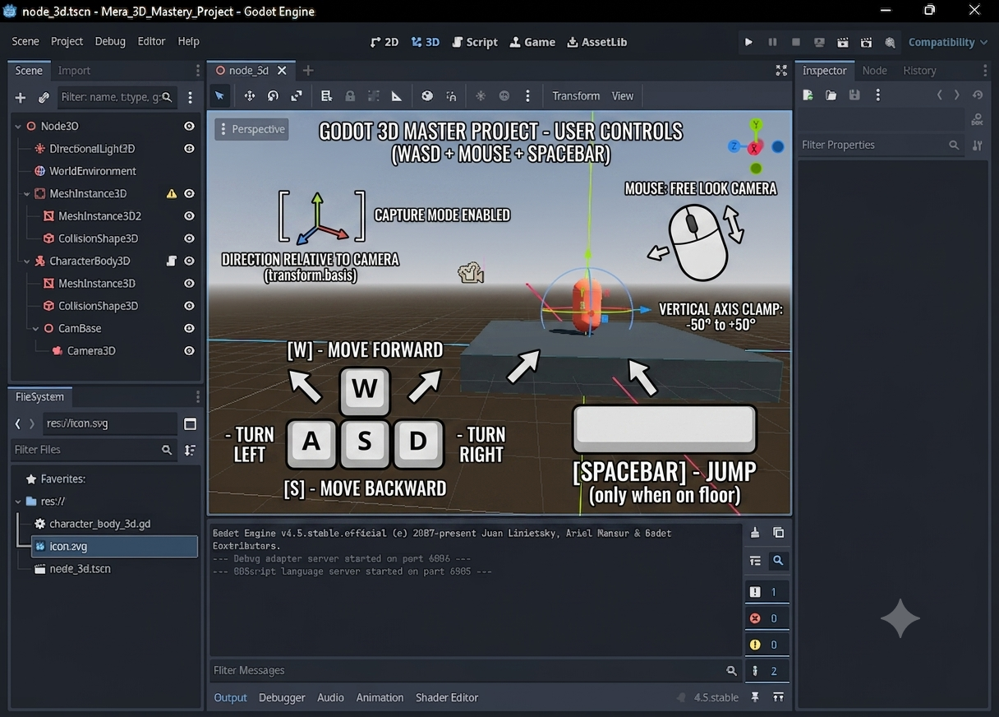

# Godot 3D Master Project 🚀

Welcome to the **Godot 3D Master Project** built natively using the powerful **Godot Engine (v4.x)**. This repository showcases a high-performance 3D Character Controller featuring responsive kinematic movement vectors, automated gravity calculations, and an orbit-clamped mouse-look camera rig.

---

## 🎮 Controller Layout & Gameplay Overview

Neeche diye gaye custom interface aur graphic layout ko dekh kar aap is project ke core controls aur vector translations ko samajh sakte hain:



### ⌨️ Detailed Keybindings Specifications

- **`W` Key:** Accelerate player velocity vector Forward ($Z-$ Axis negative).
- **`S` Key:** Accelerate player velocity vector Backward ($Z+$ Axis positive).
- **`A` Key:** Strafe player velocity vector to the Left ($X-$ Axis negative).
- **`D` Key:** Strafe player velocity vector to the Right ($X+$ Axis positive).
- **`Spacebar`:** Triggers a sudden vertical impulse (`JUMP_VELOCITY = 4.5`). This execution condition only evaluates to true when `is_on_floor()` confirms the character hull is touching the ground.
- **`Mouse Motion`:** Captures the desktop cursor (`Input.MOUSE_MODE_CAPTURED`) to rotate the character layout 360° on the $Y-$ Axis (Yaw) and tilts the camera pivot up/down on the $X-$ Axis (Pitch).

---

## 🛠️ Core Mechanics Implemented

1. **Camera-Relative Translation (`transform.basis`):** Movement is not locked to global coordinates. Pressing `W` will always push the player in the exact direction the camera is currently facing.
2. **Vertical Axis Rotation Clamping:** Implements a hard limit using `clamp()` to lock vertical camera pitch strictly between `-50°` and `+50°`. This prevents the camera from flipping completely upside-down.
3. **Smooth Deceleration Friction:** When all keys are released, `move_toward()` smoothly interpolates horizontal velocity vectors to zero, avoiding abrupt mechanical stops.

---

## 📂 Project Structure & Node Hierarchy

- 🏃 **CharacterBody3D (Player):** The physical body capsule controlling kinematics and environment slide collisions.
  - 📦 **MeshInstance3D (Capsule):** Visual capsule geometry representation.
  - 📐 **CollisionShape3D:** Boundary hull checking wall and floor impacts.
  - 📁 **CamBase (Node3D):** Separate pivot node handling up/down pitch rotations without distorting character tilt.
    - 🎥 **Camera3D:** The active viewport offset positioned cleanly behind the character.

---

## 🚀 How to Clone and Run the Project Locally

Agar aap is project ko apne desktop machine par download aur run karna chahte hain, toh apne terminal environment mein niche diye gaye code blocks ko execute karein:

### 1. Repository Ko Clone Karein

Apne terminal ya command prompt ko open karein aur yeh command input karein:

```bash
git clone [https://github.com/amirsohail100/Godot_second_person_moment_3D.git](https://github.com/amirsohail100/Godot_second_person_moment_3D.git)

Advanced 3D Player Controller built with Godot 4. Features smooth viewport camera orbit, mouse capturing, dynamic gravity bounds, and camera-relative vector movement logic.
```
